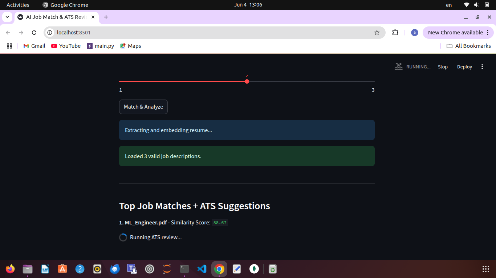

# AI Resume Matcher + ATS Reviewer

This app semantically matches resumes to job descriptions using local embeddings (FAISS) and provides ATS-style improvement feedback using a local LLM (Mistral via Ollama).

### Features
- Upload resume + multiple job descriptions
- Semantic matching using Sentence Transformers + FAISS
- ATS-style resume review using Mistral (via Ollama)
- Real-time feedback streamed to your browser
- Supports PDF, DOCX, and TXT formats

### Tech Stack
- Python, Streamlit
- FAISS for similarity search
- Sentence Transformers (`all-MiniLM-L6-v2`)
- Ollama running Mistral locally for LLM inference

### How to Run

1. Install dependencies:
    ```bash
    pip install -r requirements.txt
    ```

2. Run the app:
    ```bash
    streamlit run app.py
    ```

3. Make sure Ollama is running:
    ```bash
    ollama run mistral:instruct
    ```
## 🖼️ Demo Screenshots

### 🔹 Resume & Job Upload


### 🔹 Top Matches with Similarity


### 🔹 ATS Review (LLM Output)

